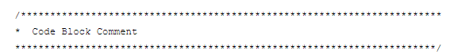
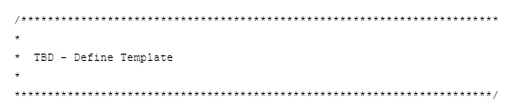

# Java/Robot Code Standards for Team 2637

Refrencing 3476 [Java Code best practices](https://github.com/FRC3476/style-guides/blob/master/java-style-guide.md) by @jackw01, @AraknosDe
and [2637 Code Standards Presentation](https://docs.google.com/presentation/d/1sKjgOOEfPU-1lpW2Q55ssY6NsyhUO9tG/edit#slide=id.p5) (Updated October 2022 version)

Author: [Kynam Lenghiem](https://github.com/Noto501)

## Introduction
---
These coding standards have been created to:
- Make software easier to understand
- Make software easier to update/maintain
- Reduce the frequency of software compile/runtime errors.


## Project Structure
---
Timed based Model:
- **Autonomous folder** contains files related to controling a robot during autonomous phase of a match.

- **DataLogger folder** contains files related to the datacollection of specfic variables for debuggging and tunning of the robot.

- **Mechanisms Folder** contains files related to the operation of each of the robot mechanisms. 

        Mechcanism: A mechanical subsystem used to perform an operation of a robot. (ie Drivetrain allows the robot to move on a gamefield)

- **Robot Folder** contains files related to controling the main robot code loop that will periodically call various robot methods to control the robot based on operator/code input

<font size = 4> Example project structure:</font>


    


## Editor settings
---

### Auto Save
Auto Save should be enabled/checked for VS code as shown in this example.

This is done as a convience when comitting and pushing code to a github repository.

Files --> autosave


## Formatting
---
### Whitespace
- Always pad operators, code blocks, and comma-seperated lists with spaces.

This is done to improve the readability of code.
    
    Code Blocks: Functionally related code section to perform a specific sub-task

```Java
// Good
public int method(int a, int b) {
    int c = 0;
    if (a >= (b + 1)) {
        c = (a - b) * 2;
    }
    return c;
}

// Bad
public int method(int a,int b){
    int c=0;
    if(a>=(b+1)){
        c=(a-b)*2;
    }
    return c;
}
```

### Parenthesis 
Similarly to math, parenthesis in code dictates the order various operations are evaluated in.

        Precedence: The specific order in which various operations are evaluated in.
        (e.g. multiplication before addition)

Be specific and explicit about precedence in code to minimize the chance of logical bugs within conditional statments.

```java
int x, y, z, a, b, c, l;

//bad
x =  l / x + y * z / c - b / a;
//better
x =  (l / x) + ((y * z) / ((c - b) / a));
```

### Arrays and Enum Formmating
```java
// Recommended for short initializers
new int[] {0, 1, 2, 3};
private enum State { ON, OFF }

// Recommended for longer initializers
new int[] {
  0, 1, 2, 3
}; 

private enum State { 
                     STATE_1, 
                     STATE_2,
                     STATE_3 
                             }
```
### Double Negatives in code
Write code in positive terms instead of negative terms.
```java
//bad, because conditional is written in negative terms
if (!isDisabled())
{
   <Code Block A>
}
else
{
   <Code Block B>
}

//Ok, since the two negative terms have been seperated, making it easier to understand for the programmer
if (isDisabled() == false)
{
   <Code Block A>
}
else
{
   <Code Block B>
}

//better, since the conditional is written in positive terms
if (isDisabled() == true)
{
   <Code Block B>
}
else
{
   <Code Block A>
}
```

Writing code in positive terms makes the code much easier for humans to process.

### Declarations
Avoid multiple declarations per line
```java
//bad
int level; String stringA 

String stringB; int size

//better
int     level;	        
int     size;	
     
String  stringA;
String  stringB;
```

- This allows comments to be written for each declared variable.

Declarations should be sorted by the method they are used in(i.g. cmdProcElevator, startElevatorThread), then by the type(i.g. double, int).

- This helps programmers easily find variables related to a certain method during troubleshooting/tuning.

### Imports
All imports should be grouped at the top of a class.

Avoid using wildercard(aka star) imports.
### Magic Numbers

Avoid magic numbers(arbitrary values in a code block).
Specifically ***define arbitrary constant values as constants*** in the **CatzConstants** class or at the **top of the mechanism class.**

```java
//bad
Timer driveTimer = new Timer();

  driveTimer.Start();
  while(driveTimer.get() < 12.5)
  {
     //drive forward
  }

//better
public static final double AUTO_SEG1_TIMEOUT_SEC = 12.5;


Timer driveTimer = new Timer();
	driveTimer.Start();

	while(drivertimer.get() < AUTO_SEG1_TIMEOUT_SEC)
	   {
	   //Drive Forward
	   }
```

### Constants and States
Define constants that represent a state value vs using true/false.

- This is done to improve readability.

```java
//bad
if (getJawState() == true)
{
   //Code Block for Open
}
else
{
   //Code Block for Closed
}

//better
public static final boolean OPEN   = true;
public static final boolean CLOSED = false;

if (getJawState() == OPEN)
{
   //Code Block for Open
}
else
{
   //Code Block for Closed
}
```
### Inputs and Code Blocks
When collecting inputs from controllers, encoders, sensors, etc, avoid collecting them in **conditionals** or in the **middle of code blocks.**

- Doing so can lead to strange behaviours in code as values can change during code block/if statement processing.

Therefore, all inputs **should be collected and stored in variables before** they are used in conditional evaluation or in code-blocks.

```Java
//bad
private final double TRIGGER_AXIS_RT_DEADBAND = 0.1;
if(xboxAux.getRightBumper() && Math.abs(xboxAux.getRightTriggerAxis()) > TRIGGER_AXIS_RT_DEADBAND)
{
  climb.climbElevatorManualCntrl(xboxAux.getRightTriggerAxis()); //down
}

//better
    private final double TRIGGER_AXIS_RT_DEADBAND = 0.1;
   	double elevatorDnInput           	= xboxAux.getRightTriggerAxis();
   	double elevatorUpInput           	= xboxAux.getLeftTriggerAxis();


   	if(Math.abs(elevatorDnInput) > TRIGGER_AXIS_RT_DEADBAND)
   	{
     	climb.climbElevatorManualCntrl(elevatorDnInput);
   	}
```


## Naming
---

### General Guidlines
Names should be meaningful to the programmers maintaining/writing the code to prvent confusion at a later time.


Long names > short names 


Avoid giving classes, methods, constants, or variables that have similar meanings different names.

```java
LIFT_ENCODER_DIOA			= 2;	//’A’ should go with Encoder
LIFT_ENCODER_CH_A_DIO_PORT	= 2;  //Better


run()								//What are we running?
runLiftMotor()


MAX_TEMPERATURE            = 85.0;	//Max Temp for what?
MAX_LIFT_MOTOR_TEMPERATURE = 85.0;
```
Avoid variable names starting with possesives/articles (i.g. a, an, my)

```java
//bad
private static CatzElevator;

public void RobotInIt()
{
    CatzElevator myCatzElevator = new CatzElevator();
}

//better
private static CatzElevator;

public void RobotInIt()
{
    CatzElevator elevatorSubsystem = new CatzElevator();
}
```
Names in code should match represented names on a User Interface(i.g. advantagescope, shuffleboard) 

- This is done to correctly and quickly associate a screen name with a variable name in code.

```Java
//bad
public void smartDashboardElevator()
    {

        SmartDashboard.putBoolean("Low Limit Switch", lowSwitchState);
        SmartDashboard.putBoolean("High Limit Switch", highSwitchState);

    }
//better
public void smartDashboardElevator()
    {

        SmartDashboard.putBoolean("lowSwitchState", lowSwitchState);
        SmartDashboard.putBoolean("highSwitchState", highSwitchState);
    }
```


### 1. Class Naming Convention
- Format: noun
- Style: First letter of each word is ***uppercase***


```java
class States;
class GameHandler;
```


### 2. Method Naming Convention
- Format: verb/action + noun
- Style: `Camel Case` (First letter is all ***lowercase*** + first letter in each supsequent word is ***uppercase***)


```java
openForearm()
readLiftLimitSwitchTop()
```


### 3. Variable Naming Convention
- Format: verb/action + noun
- Style: `Camel Case` (First letter is all ***lowercase*** + first letter in each supsequent word is ***uppercase***)

```java
public static Encoder drvTrainEncoderL;
public static Encoder liftEncoder;
```

- Include ***units of measurment*** when applicable.

```java
public static double distanceInFt;
```

- Avoid reusing variable names in different scopes in the same method unless the variables will be set equal to each other using the "this." keyword
```java
private int cmdStateUpdate
void cmdProcElevator(int cmdStateUpdate)
{
    this.cmdStateUpdate = cmdstateUpdate
}
```


### 4. Constants Naming Convention
***"\*" = if applicable***
- Format: [Min/Max]*_[subsystem name]\_[noun]\_[noun]\*
- Style: `UPPER_SNAKE_CASE`


```java
public static final LIFT_ENCODER_CH_A_DIO_PORT = 2;
public static final MAX_LIFT_MOTOR_TEMP = 85.0;
```

### Standard Names & Abbreviations & Acronyms
- When picking abbreviations that have multiple values (e.g. left/right or left/middle/right), the abbreviation for each value should have the ***same number of letters.***

```java
private double turnSpeedLT = 0.5;
private double turnSpeedRT = -0.5
```
This helps keep variables aligned

- Acronyms should always be capitalized.
- Only use ***understood and standardized*** acronyms for variable names (i.g. HTTP, CAN, PID, I2C). 
- Do not abbreviate unless the abreviated word is ***commonly understood.*** (i.g. Id, Pos)


<font size = 4> Current Abreviation Standards: </font>

- ***Fwd, Rev***	= Forward, Reverse
- ***LT, RT***	= Left, Right
- ***MC***		= Motor Controller
- ***pd***		= PDP or PDH  
- ***Xxx***		= Encoder
- ***i*** = loop iterating in a for conditional statement or 1 dimensional array.
- ***i,j,k*** = for 2/3 dimensional arrays.
- ***x, y, z*** = for representing cordinates in a 3 dimensional space.


### Short Variable Names
Single letter variable names should not be used unless used in a conditional 
```java
int armNumCount = 0;
for (int i = 0, i <= 10, i++)
{
    armNumCount++;
}
```


## Documentation/Commenting
---
### Comment Guidlines
- Avoid writting comments for code that is self-explanatory.
- Write comments to explain complex logic or algorithms.
- Write comments if you need to take time to process the code every viewing.
- Try to write code that is self explanatory (Avoid long conditional statments, long math operations that could be broken down, double negatives, etc.)


### TBDs
- write "//TBD - [message]" in code sections that need to be updated or changes at a future date
- writing a consistent phrase such as TBD can make it easier to go back and find the areas of code that you need to update.
```java
xboxDrv = new xboxDrv(1); // - TBD what port number for the xbox controller
```


### File header Comment Blocks 
- Should be defined at the top of every class
- Should contain general information about the class



### Code block headers
- Should be placed before a code block.
- Avoid describing what the code block logically does
- Instead, explain the intent of the code block (ie. this method determines the updated state for the robot)


### Single Line Statments
- short comments to help explain the logic behind a section of a code block.
- Should be placed at the end of a line of code or before a section of code.
- Eventaully these statement need to be removed and cleaned up(any logic that needs to be explained should go in code block headers)

  ```java
 \//for shuffleboard
MOTOR_ID = steerMotorID;
  ```


